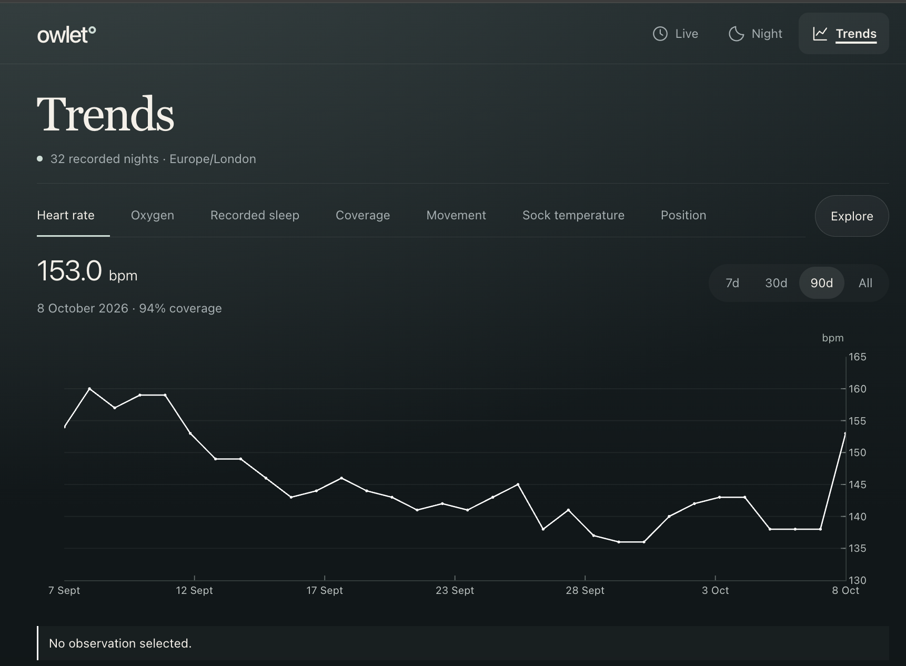
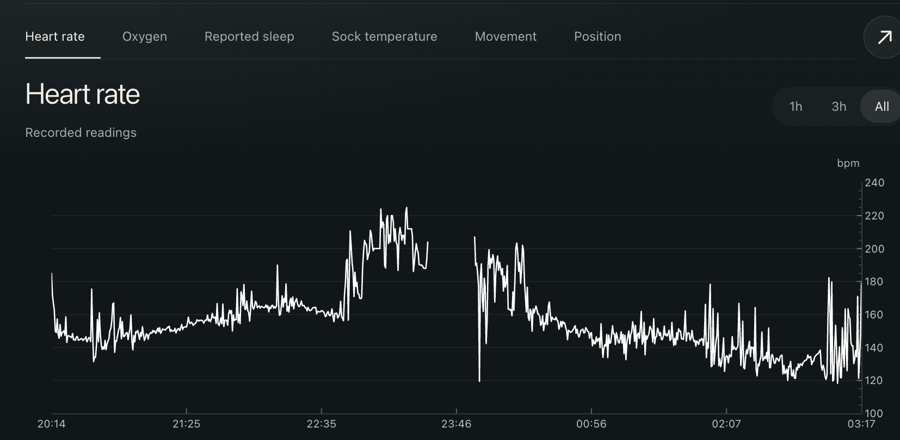

+++
title = 'Baby Immunisations'
date = 2026-10-09T02:20:00Z
draft = false
+++

Baby had first immunisations yesterday. Babies usually get fever after the menB vaccine so we give them paracetamol on a 4-hourly basis.

He seemed fine up until we woke him for an 11pm feed (they encourage frequent feeds), when he wouldn't feed and the Owlet sock started beeping as his heart rate was higher than 220.

Looking at the data now 1) the average heart rate is clearly higher than previous nights - cool to see spike!

2) the live heart rate is trending up as the night progresses up until we give him paracetamol again at 11:30 where it trends down as he goes to sleep.

