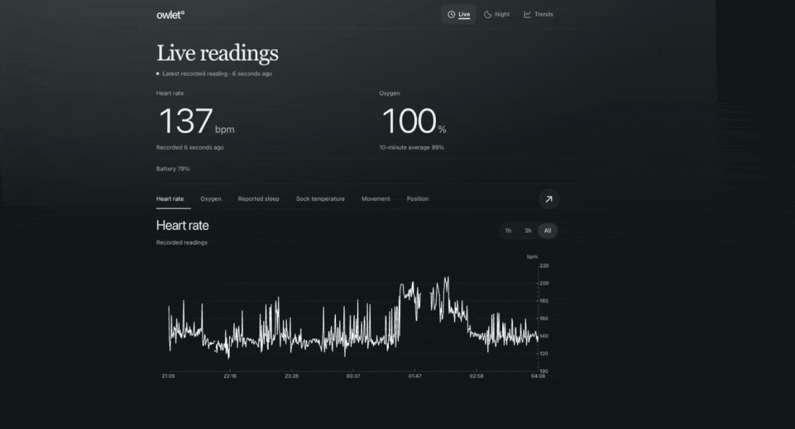
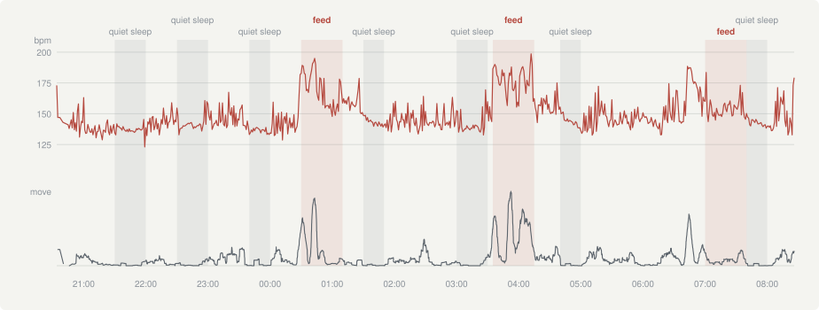
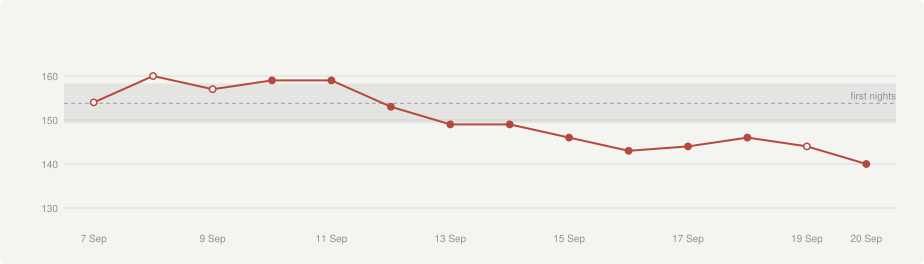

+++
title = 'Baby Statistics'
date = 2026-09-21T02:41:07Z
draft = false
+++

<!-- ===================================================================
OUTLINE. Everything in HTML comments is scaffolding for you and never
renders. Delete each block as you write over it.

Working title above is a placeholder. Others: "What the Sock Saw",
"Still", "Heart Rate and Stillness".

Charts are page-bundle resources sitting beside this file. To change one,
re-export from the owlet project (Tailscale must be up, the Box holds the
data):

    cd ~/projects/owlet-monitor
    python3 scripts/export_charts.py <this folder> 2026-09-19

The second argument is the night that night.svg draws. Feed times are set
at the bottom of that script -- the sock cannot know a feed happened, so
they come from you, not the data.

The script pulls LIVE, so the charts move between runs. Regenerate once
just before publishing and re-check the handful of numbers you quote, or
the prose and the plates will quietly disagree.

Preview needs Hugo 0.114.0 to match CI; the current brew version is too new
for the pinned theme. Also run `git submodule update --init` first.

BEFORE PUBLISHING: this is a durable, dated record of a named infant's
heart rate and sleeping pattern, and he cannot consent. Worth one
deliberate look rather than none.
==================================================================== -->

<!-- OPENER. Two or three paragraphs. Things worth landing here:
  - Leopoldo wears an Owlet sock at night. It reads heart rate from his
    foot and its job is to alarm if something leaves a safe range.
  - The turn: it is very good at "is he fine right now" and useless at
    "what happened last Tuesday". The app shows ten-minute averages and
    keeps about two days.
  - What we did: recorded it ourselves every five seconds since the 7th of
    September. Fourteen nights so far.
  - The parallel with the pregnancy post is worth naming: same instinct,
    different wearable. That one was nine months from underneath; this is
    two weeks at five-second resolution.
--> 

## Baby monitoring

Our baby wears an Owlet sock at night which reads heart rate from his foot and its job is to alarm us when something leaves the healthy range. 

The sock's quite good at "is there anything wrong right now", albeit it being a few seconds delayed but within the iPhone app, it's very hard to see historical data (it is also averaged across 10 minutes) and teh data only persists for only about 2 days. The iPhone app is also really bad. 

<!-- THE FACTS. All verified against Owlet's own API.
  - The endpoint that returns readings caps at 100 rows. About eight
    minutes.
  - It advertises date filters and silently ignores them. Ask for last
    Tuesday, get the last eight minutes.
  - Its pagination looks real and is not. Following the "next page" cursor
    forty times returned the same eight-minute window forty times: 4,000
    rows fetched, eight minutes of unique data.
  - One exception: an undocumented summary blob holding roughly two days of
    ten-minute windows. We decoded it and checked every field against our
    own recordings first. One field looked exactly like battery and was
    not, which is the reason for checking.
  - The recorder CAUSES the data. The base station only uploads while an
    app is marked active, so our poller is what keeps the stream alive.

THE ANGLE. The asymmetry is the story, and it is not really about Owlet.
The most detailed record of your own child's first weeks exists for eight
minutes at a time and is then gone, unless you happen to be standing there
catching it. Nothing is withheld exactly. It simply is not kept.
-->

## What we built

Below is the live page, reading every 5 seconds. 

What we are doing here is we are streaming and recording the data ourselves from the Owlet API and we have collected about 2 weeks of data so far. 

You can see that the single glances at the updating heart rate and oxygen which is what the Owlet app provides don't tell you much about long-term trends and what happens throughout the night. 

<!-- THE FACTS.
  - The recorder runs on a small always-on box and polls every five seconds.
    The page above is it, unedited, over about thirty seconds.
  - The number moves every few seconds because each reading is a new one:
    135, 137, 155, 140, 132. That spread is roughly a fifth of his whole
    nightly range, inside half a minute.
  - "Recorded 9 seconds ago" is the honesty cue. If the recorder stops, that
    number climbs and the page says so rather than showing a stale figure
    as though it were current.

THE ANGLE. Short section, and mostly there so the reader can see the thing.
Worth one observation though: the live number is almost useless on its own.
It jumps 20 bpm between consecutive readings, so any single glance tells
you very little -- which is exactly why the rest of the post is about
windows, medians and percentiles rather than about what it says right now.

Optional: the app on your phone shows a smoothed ten-minute average, which
looks calmer and more reassuring. This shows the raw thing underneath it.
-->

## One night

For an example evening, I have labelled the quiet sleep sections and feeds throught the evening. 

Every grey band is
a place where the top line goes flat and the bottom one goes quiet at the
same moment. That is quiet sleep. Newborn sleep is formally split into
active and quiet sleep with quiet sleep partly defined by this:
decreased body movement, and a heart rate that is lower and less variable.

Researchers classify neonatal sleep state from heart-rate variability alone
at an AUC of about 0.87. We are able to achieve a similar result froma publiched method just with a sock and streaming the baby statistics from it, which is pretty cool.

What you learn to do when you have a baby is squeeze 70 seconds out of a minute (i.e. you learn to be hyper-efficient). 
The baby is generally much harder to wake up when he is in quiet sleep so over time when I see a quiet sleep period starting it can be helpful to get ready for doing some activity, like taking him out for coffee, cleanign the apartment, exercising etc.  

<!-- THE FACTS. Bands are the ones you identified, checked against the data
before being written down.
  - One night, 20:34 to 08:20, at five-second resolution. Heart rate on
    top, movement underneath, sharing one clock.
  - Grey bands, flat and still. Five you identified, two the detector
    found, merged:
        21:30-22:00   137 bpm, variability 3.5, movement  6%
        22:30-23:00   140 bpm, variability 6.1, movement 10%
        23:40-00:00   136 bpm, variability 1.8, movement  2%   (detected)
        01:30-01:50   142 bpm, variability 1.4, movement  1%   (detected)
        03:00-03:30   139 bpm, variability 7.8, movement 10%
        04:40-05:00   142 bpm, variability 2.1, movement  2%
        07:40-08:00   143 bpm, variability 1.6, movement  2%
  - Red bands, three feeds: 00:30, 03:35 and 07:00.
  - The early-hours feed begins at 03:35, not 04:00 -- heart rate goes
    146 to 188 and movement 40% to 96% inside five minutes.
  - Every feed is followed by a quiet stretch. 03:35 settles into
    04:40-05:00, and 07:00 into 07:40-08:00, the two flattest windows of
    the night.

THE ANGLE, first half. The two panels are the argument. Every grey band is
a place where the top line goes flat and the bottom one goes quiet at the
same moment.

That is quiet sleep. Newborn sleep is formally split into active and quiet
sleep, and quiet sleep is partly defined by exactly what these bands show:
decreased body movement, and a heart rate that is lower and less variable
than in active sleep [1]. Researchers classify neonatal sleep state from
heart-rate variability alone at an AUC of about 0.87 [2] -- we are doing a
crude version of a published method with a sock and a poller.

THE ANGLE, second half, and the better half. My first instinct was that his
heart rate DROPS after a feed. The literature says the opposite: feeding
raises heart rate in newborns, through withdrawal of parasympathetic tone
[3]. Both are true, and this night shows why -- by 03:30 he is already
restless and running at 175, the feed takes him to 199, and then he settles
to 144. What I had been calling "the drop after feeding" is the recovery,
and it lands him lower than he started.

Write the version where you correct yourself. It is more interesting than
the version where you were right.

ONE THING TO DECIDE. There is an unlabelled event at 00:30: heart rate goes
from a calm 137 to 195, a rise of 58 bpm, with a matching movement spike.
That is a larger and sharper jump than either labelled feed, and it starts
from a quiet baseline rather than from a baby already stirring. If that was
also a feed it belongs on the chart; add "00:30" to FEEDS in the export
script. If it was something else -- a nappy change, a startle -- it is worth
a sentence, because it is the most dramatic thing on the chart and a reader
will ask.
-->

<!-- THE FACTS. Ten-minute windows, pooled across the ten nights with good
coverage. 637 windows in total.

     movement        n    median HR    variability
     still (<5%)    71        142            2.1
     5-15%         108        143            3.4
     15-30%        155        147            6.1
     30-50%        138        152            7.5
     restless      165        172            9.2

  - Still windows sit 30 bpm below restless ones.
  - Variability is more than four times lower when he is still.
  - The relationship is monotonic. Every step up in movement is a step up
    in heart rate, with no exceptions.
  - The grey band is the typical within-window variability, so the chart
    carries both halves at once: the line rises AND the band widens.

THE ANGLE. This is the chart that turns one night's observation into a
claim. On a single night, "he was still and his heart rate was low" could
be a coincidence. Across 637 windows it is a dose-response.

It is also the cleanest statement of the thing itself: level and
variability move together, which is precisely how quiet sleep and active
sleep are distinguished [1]. You are not measuring two things. You are
measuring one thing twice.

Worth being honest about the direction of causation, which this cannot
settle: a still baby has a low heart rate because he is in quiet sleep, not
because stillness lowers heart rate. The sock sees the correlate, not the
cause.
-->

## Heart rate is falling

The decline over the last two weeks is interesting but unsurprising - as the nervous system controlling it is still being built it takes a while to come into a regular cadence. 

<!-- THE FACTS.
  - 154 bpm on the first night, 140 on the most recent.
  - The grey band is the first five solid nights, the same device as the
    "before" band in the pregnancy post.
  - THE HOLLOW DOTS MATTER. Four nights are drawn hollow because coverage
    was under 85% -- the first three were 17%, 71% and 39%, before the
    recorder moved off a laptop that kept falling asleep.
  - The decline holds if you drop the hollow nights entirely. Say so.

THE ANGLE. Seeing the decline this cleanly over two weeks is the part I did
not expect. But it is worth explaining WHY it happens, because the reason
ties the whole post together.

A newborn's heart is not slowing down because it is getting stronger. It is
slowing down because the nervous system controlling it is still being
built. The two halves of the autonomic nervous system mature at different
rates: the sympathetic half -- the accelerator -- is already running at
birth, while the parasympathetic half, the vagal brake, arrives later and
strengthens over the following weeks [4]. As that brake comes online, the
resting rate falls, reaching something close to adult control within about
six to eight weeks [5].

Which means this chart and the feeding chart are the same mechanism seen at
two speeds. A feed causes a brief withdrawal of that vagal brake and the
heart rate jumps [3]. Over weeks, the same brake strengthens and the
baseline comes down [4][5]. Fourteen nights of a line drifting downwards is
that system being installed.

The hollow dots are doing real work and are worth a sentence. A partial
night is biased towards whenever the sock happened to be on, which is
exactly how you manufacture a trend out of nothing. Putting the caveat in
the drawing rather than in a footnote is the only version anybody reads.
-->

<!-- FINAL THOUGHTS Short, and the section that keeps the post honest. Candidates:
  - There is no comparison to other babies and there cannot be. The API
    only ever exposes your own device, so "how does he compare" is
    unavailable by construction. Given that comparison is most of what new
    parents want, worth naming.
  - It is a record, not a monitor. It polls a cloud after the fact and can
    stop silently; the sock and its app remain the alarm.
  - n = 1, fourteen nights. What one baby's data looks like, not what
    babies do.
  - The quiet-sleep bands are OUR derivation, from flat heart rate and no
    movement. The sock reports its own sleep state and rarely says "deep".
    Worth one line that we are not reading its label, we are reading the
    physiology underneath it.
-->

<!-- CLOSER. Optional. The question worth ending on is what two more months
shows that fourteen nights cannot: whether the share of the night spent
still keeps growing, and whether the heart rate keeps falling or settles. -->

---

<!-- 
**Sources**

1. [Sleep Disturbances in Newborns](https://pmc.ncbi.nlm.nih.gov/articles/PMC5664020/) — active versus quiet sleep, and how each is defined
2. [Unobtrusive assessment of neonatal sleep state based on heart rate variability](https://pubmed.ncbi.nlm.nih.gov/28733087/) — classifying sleep state from heart-rate variability alone, AUC 0.87
3. [Cardiorespiratory measures before and after feeding challenge in term infants](https://onlinelibrary.wiley.com/doi/10.1111/j.1651-2227.2009.01284.x) — the postprandial heart rate rise
4. [Autonomic Cardiorespiratory Physiology and Arousal of the Fetus and Infant](https://www.ncbi.nlm.nih.gov/books/NBK513398/) — sympathetic and parasympathetic control mature at different rates, shifting towards parasympathetic dominance after birth
5. [Heart Rate Variability Analysis to Evaluate Autonomic Nervous System Maturation in Neonates](https://pmc.ncbi.nlm.nih.gov/articles/PMC9069105/) — heart rate falls to adult levels within six to eight weeks as vagal tone rises
---