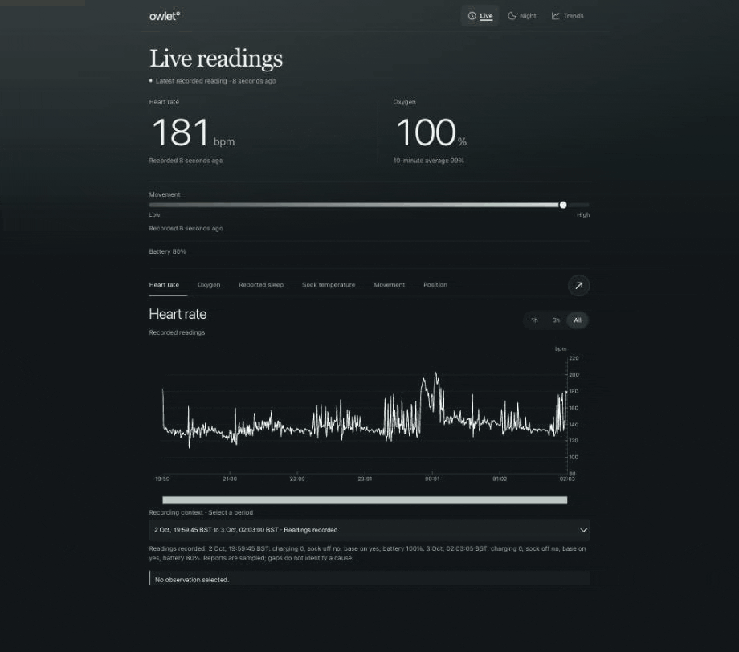
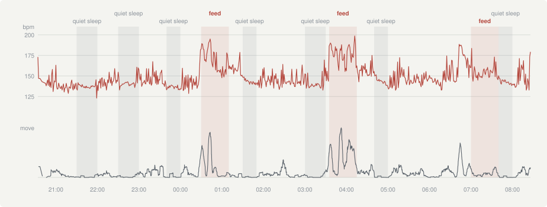
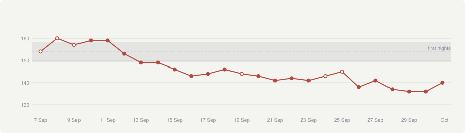

+++
title = 'Baby Statistics'
date = 2026-09-21T02:41:07Z
draft = false
+++

<!-- ===================================================================
OUTLINE. Everything in HTML comments is scaffolding for you and never
renders. Delete each block as you write over it.

Working title above is a placeholder. Others: "What the Sock Saw",
"Still", "Heart Rate and Stillness".

Charts are page-bundle resources sitting beside this file. To change one,
re-export from the owlet project (Tailscale must be up, the Box holds the
data):

    cd ~/projects/owlet-monitor
    python3 scripts/export_charts.py <this folder> 2026-09-19

The second argument is the night that night.svg draws. Feed times are set
at the bottom of that script -- the sock cannot know a feed happened, so
they come from you, not the data.

The script pulls LIVE, so the charts move between runs. Regenerate once
just before publishing and re-check the handful of numbers you quote, or
the prose and the plates will quietly disagree.

Preview needs Hugo 0.114.0 to match CI; the current brew version is too new
for the pinned theme. Also run `git submodule update --init` first.

BEFORE PUBLISHING: this is a durable, dated record of a named infant's
heart rate and sleeping pattern, and he cannot consent. Worth one
deliberate look rather than none.
==================================================================== -->

<!-- OPENER. Two or three paragraphs. Things worth landing here:
  - Leopoldo wears an Owlet sock at night. It reads heart rate from his
    foot and its job is to alarm if something leaves a safe range.
  - The turn: it is very good at "is he fine right now" and useless at
    "what happened last Tuesday". The app shows ten-minute averages and
    keeps about two days.
  - What we did: recorded it ourselves every five seconds since the 7th of
    September. Fourteen nights so far.
  - The parallel with the pregnancy post is worth naming: same instinct,
    different wearable. That one was nine months from underneath; this is
    two weeks at five-second resolution.
--> 

## Baby monitoring

Our baby wears an Owlet sock at night which reads heart rate from his foot and its job is to alarm us when something leaves the healthy range. 

The sock's quite good at telling us "is there anything wrong right now", albeit it being a few seconds delayed. Within the iPhone app, it's very hard to see historical data (it is also averaged across 10 minutes) and the data only persists for only about 2 days. The iPhone app is also really badly designed.

Our project is open-sourced at: https://github.com/YoannaP/owlet-recorder

<!-- THE FACTS. All verified against Owlet's own API.
  - The endpoint that returns readings caps at 100 rows. About eight
    minutes.
  - It advertises date filters and silently ignores them. Ask for last
    Tuesday, get the last eight minutes.
  - Its pagination looks real and is not. Following the "next page" cursor
    forty times returned the same eight-minute window forty times: 4,000
    rows fetched, eight minutes of unique data.
  - One exception: an undocumented summary blob holding roughly two days of
    ten-minute windows. We decoded it and checked every field against our
    own recordings first. One field looked exactly like battery and was
    not, which is the reason for checking.
  - The recorder CAUSES the data. The base station only uploads while an
    app is marked active, so our poller is what keeps the stream alive.

THE ANGLE. The asymmetry is the story, and it is not really about Owlet.
The most detailed record of your own child's first weeks exists for eight
minutes at a time and is then gone, unless you happen to be standing there
catching it. Nothing is withheld exactly. It simply is not kept.
-->

## What we built

We built a replacement, which we now use instead of the Owlet app. Below is a little GIF of the live page, reading every 5 - 10 seconds, as well as showing a trends page of averages across time. We're streaming and recording the data ourselves from the Owlet API and recording it in our box.

Live monitoring: The Live tab shows the current heart rate, oxygen levels and movement at a snapshot, similar to the original Owlet app. But it also now has a timeseries plot across all metrics (heart rate, oxygen, movement, temperature etc) so you can clearly see if the baby has been in deep sleep, for how long and how his sleep is evolving.

Trends monitoring: The Trends tab shows averages across time where the design can be credited to the way Oura designs its app - this is what we used as a working template to make this.

<!-- THE FACTS.
  - The recorder runs on a small always-on box and polls every five seconds.
    The page above is it, unedited, over about thirty seconds.
  - The number moves every few seconds because each reading is a new one:
    135, 137, 155, 140, 132. That spread is roughly a fifth of his whole
    nightly range, inside half a minute.
  - "Recorded 9 seconds ago" is the honesty cue. If the recorder stops, that
    number climbs and the page says so rather than showing a stale figure
    as though it were current.

THE ANGLE. Short section, and mostly there so the reader can see the thing.
Worth one observation though: the live number is almost useless on its own.
It jumps 20 bpm between consecutive readings, so any single glance tells
you very little -- which is exactly why the rest of the post is about
windows, medians and percentiles rather than about what it says right now.

Optional: the app on your phone shows a smoothed ten-minute average, which
looks calmer and more reassuring. This shows the raw thing underneath it.
-->

## One night and trends

We spend a lot of time just staring at his statistics and him sleeping. Taking one night as an example, where he has fed three times, I have plotted his heart rate and movement as well as whether I think he's in quiet sleep or not based on both of those.

Every grey band is
a place where the top line goes flat and the bottom one goes quiet at the
same moment. That is quiet sleep.

Newborn sleep is formally split into
active and quiet sleep with quiet sleep partly defined by this:
decreased body movement, and a heart rate that is lower and less variable. That's basically what I used to label it.

When you look at the heart rate trend across time, it's pretty cool to see it slowly decline as his systems mature. Newborns have very high heart rates which gradually decline as they grow as their nervous systems controlling it is still being built at the start and it takes a while to come into a regular cadence.

<!-- 
**Sources**

1. [Sleep Disturbances in Newborns](https://pmc.ncbi.nlm.nih.gov/articles/PMC5664020/) — active versus quiet sleep, and how each is defined
2. [Unobtrusive assessment of neonatal sleep state based on heart rate variability](https://pubmed.ncbi.nlm.nih.gov/28733087/) — classifying sleep state from heart-rate variability alone, AUC 0.87
3. [Cardiorespiratory measures before and after feeding challenge in term infants](https://onlinelibrary.wiley.com/doi/10.1111/j.1651-2227.2009.01284.x) — the postprandial heart rate rise
4. [Autonomic Cardiorespiratory Physiology and Arousal of the Fetus and Infant](https://www.ncbi.nlm.nih.gov/books/NBK513398/) — sympathetic and parasympathetic control mature at different rates, shifting towards parasympathetic dominance after birth
5. [Heart Rate Variability Analysis to Evaluate Autonomic Nervous System Maturation in Neonates](https://pmc.ncbi.nlm.nih.gov/articles/PMC9069105/) — heart rate falls to adult levels within six to eight weeks as vagal tone rises
---
