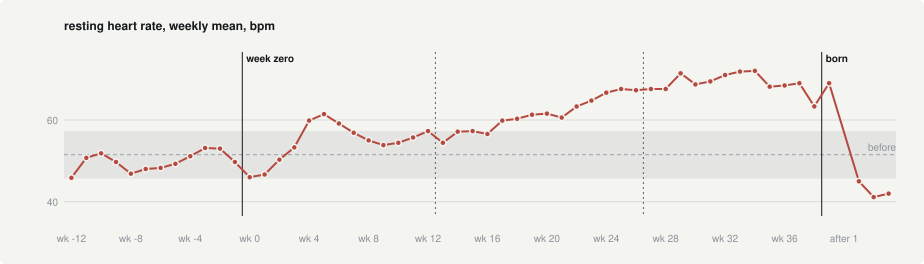
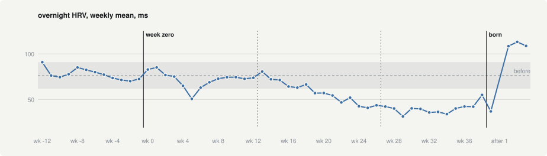
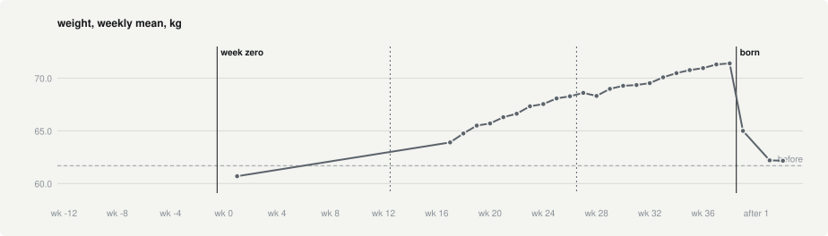
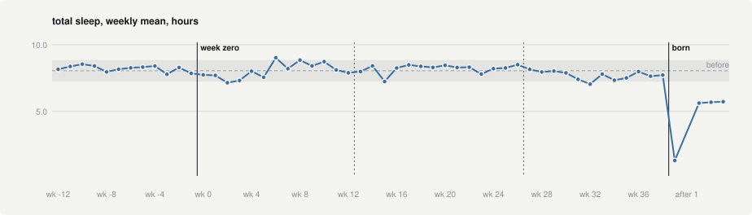
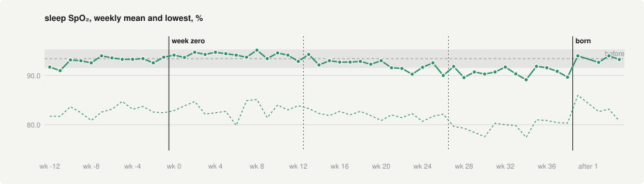

+++
title = 'Pregnancy Statistics'
date = 2026-09-09T09:00:00Z
draft = true
+++

<!-- ===================================================================
OUTLINE. Everything in HTML comments is scaffolding for you and never
renders. Delete each block as you write over it.

Working title above is a placeholder. Others: "Nine Months of Data",
"Forty Weeks on the Wrist", "The Body, Measured".

Charts are page-bundle resources sitting beside this file. To change one,
rebuild the page in ~/projects/health and re-export:

    cd ~/projects/health
    .venv/bin/python scripts/export_charts.py pregnancies/pregnancy-2026 \
        <this folder> hrv resting_hr weight sleep_total spo2

Other charts available: sleeping_hr, sleep_score, steps, body_battery,
and nights (the stacked-stages version of the sleep chart).

Preview with:  hugo server -D     (the -D shows drafts)

BEFORE PUBLISHING, note what these charts disclose on a public site:
your exact birth date (the "born" line), your weight in kg, and the
pregnancy dates. All of it is fine to share if you want to share it, but
it is worth one deliberate look rather than none.
==================================================================== -->

<!-- OPENER. Two or three paragraphs. Things worth landing here:
  - You wore a Garmin through a pregnancy and came out with about 500 days
    of continuous data either side of it.
  - The framing that makes this interesting: most people experience
    pregnancy through symptoms, which are subjective and hard to recall.
    This is the same nine months from underneath, measured every night.
  - What the baseline is: the 180 days before, which is what every grey
    band on the charts means. Say it once here and you never explain a
    chart again.
  - Optional hook: the single most striking number is that resting heart
    rate ended 20 bpm above where it started. That is roughly the
    difference between sitting and walking upstairs, held for months.
-->

I have always tracked my sleep, weight and temperature, with either a Garmin or an Oura ring, either for women's health or out of general interest.

When I got pregnant, I found it really hard to find anything online about what my statistics were supposed to look like, and mine had gone completely out of whack.

My resting heart rate jumped about ten points over Christmas, in the first few weeks, and then fell back down again. HRV did the opposite. That frightened me: I took it to mean my body had stopped being worked up by the pregnancy, and that the baby was no longer alive (yes, I am prone to overthinking).

Most women experience pregnancy through symptoms, which are subjective and hard to recall afterwards. What follows is the same set of measurements, taken every night for a year. The shaded grey band on each chart is the baseline, the six months before the pregnancy began.

## Heart works harder

<!-- THE FACTS. All verified against the data.
  - Baseline: 51.5 bpm (180 days before week zero).
  - By trimester: 54.7, then 61.2, then 69.3.
  - Weekly peak: 72.0 bpm in week 34.
  - The shape is the interesting part, and it is not a straight ramp:
      * week 4: first climb above the baseline band
      * weeks 7-16: settles back INSIDE the band
      * week 17: leaves for good, never returns
  - Within days of the birth it drops to 45.6, BELOW the 51.5 baseline.

THE ANGLE. The blood volume story is the obvious explanation and worth one
sentence, but the more interesting observation is that the change was
already visible in week four, long before most of the outward signs. The
double crossing is the detail that makes it real rather than a tidy curve.
-->

The resting heart rate baseline was about 51 bpm, by first trimester this jumped to 55, second trimester to 61 bpm and third trimester to 70 bpm. 

What was also interesting is that it didn't increase straight away and steadily after conception, but there is an initial 4 week steep climb, after which weeks 7-12 go back within the range band. After week 17, which is where the uterus is the size of large grapefruit, it starts to shoot out of range, never to return. 

Within just a few days of the birth it drops down to 46, lower than before, but I am not sure why. 

One of the more interesting things to me is that the change was already visible in week 4 in the statistics, which is much before any other symtoms tend to occur. 

## HRV

<!-- THE FACTS.
  - Baseline: 76.4 ms. By trimester: 71.5, 58.6, 39.4.
  - Lowest around week 29, at 31.4 ms.
  - Postpartum: 105.8 ms, well ABOVE the baseline. Caveat: that rests on
    14 nights, so it is a direction rather than a settled number.

THE ANGLE. HRV is the mirror of the chart above, and the pairing is the
point: two independent measurements telling the same story from opposite
directions. Worth being careful here, because HRV is the number most
likely to be over-read by a fitness-tracker audience. It fell for nine
months straight and that was normal. A useful line to write against: a
number going the "wrong" way is not the same as something being wrong.
-->

This tells a similar story to the resting heart rate, but it is basically two numbers telling you the same thing (again change in week 4, then back to normal, until it starts to deviate again in the second trimester)

## Weight (the obvious one)

<!-- THE FACTS.
  - 60.7 kg in week 1, to 71.3 kg on 6 August. A gain of 10.6 kg.
  - A month after the birth: 62.7 kg.
  - HONEST CAVEAT, worth stating rather than hiding: there is exactly one
    reading in week 1 and then nothing until week 17. The long straight
    line on the left of the chart is two points joined across fifteen
    unmeasured weeks, not a record of steady gain. From week 17 the
    readings are near-daily.

THE ANGLE. This is the one number people already expect, so it can be the
short section. Its real job here is contrast: it is the only change on the
page that was visible from the outside, and it is far from the largest in
proportional terms. Resting heart rate moved 40%, HRV moved 50%, weight
moved 17%.
-->

This is obvious but I find it fascinating to see how much weight the body actually carries and releases after birth. 

## Sleep

<!-- HEADING. Alternatives if you prefer: "The line that only breaks once",
"Nine months flat, then a cliff", "The one that did not move".

THE FACTS.
  - Baseline: 8.04 hours a night, standard deviation 0.81.
  - 36 of the 39 pregnancy weeks sit within one standard deviation of that
    baseline. Duration essentially did not change while pregnant.
  - Range across the pregnancy: 9.02h in week 6, down to 7.04h in week 32.
  - By trimester: 8.1, 8.2, 7.7. The third is the only one that dips.
  - After the birth it settles at about 5.7 hours.
  - CAVEAT for the deep point right after the "born" line: that is 1.32
    hours, and it is a SINGLE night, the night of the birth itself. Do not
    describe it as a week. The week after it has no data at all.

THE ANGLE. This chart is the flat one, and that is what makes it worth
including. Eight of the other figures on the wrist moved a long way, and
the number most people would actually ask about, how much sleep you got,
did not move at all until the baby arrived. The whole change is
compressed into the right-hand edge.

NOTE ON WHAT THIS CHART NO LONGER SHOWS. The stacked version carried a
second story: sleep quality degraded steadily while duration held.
Efficiency went 98.1%, 96.9, 95.7, 94.8, and time awake in bed roughly
doubled across the pregnancy. Those numbers are still true and you can
write them, but the reader can no longer see them. Two options if you want
that visible again: add sleep_score.svg as a second chart in this section,
or say it in a sentence and let this chart carry only the duration point.
-->

How much sleep I got throughout the whole day actually did not move at all out of range until the baby arrived, now being around 6 hours scatted in naps across the whole 24 hours. It did dip slightly in the third trimester though. 

## Sleep Sp02

<!-- HEADING. Yours to rename. Alternatives: "Oxygen while asleep",
"Breathing for two", "The one I trust least".

TWO LINES ON THIS CHART. The solid line is the average overnight oxygen
saturation for the week. The dashed line below it is the lowest reading
of each night, averaged over the week. Worth one sentence for the reader,
since every other chart in the post has a single line.

THE FACTS.
  - Average: baseline 93.4%, then 94.2 in the first trimester, 92.2 in
    the second, 90.7 in the third.
  - Lowest-of-night: baseline 83.6%, then 83.1, 82.0, 79.6.
  - Both bottom out in week 34, at 89.1% average and 77.4% lowest.
  - Both are back to baseline within the month after the birth: 93.5 and
    83.1, which is almost exactly where they started.
  - The first trimester is slightly ABOVE baseline on the average line
    before it turns. It is the only figure in the post that goes the
    "wrong" way first.

THE ANGLE. This is the slowest and steadiest of the four lines, with no
week-4 spike and no drama, just a drift downward that only clearly leaves
the band in the third trimester. It pairs with a number not charted here:
respiratory rate went from 13.6 breaths a minute at baseline to 16.2 in
the third trimester. Breathing faster and oxygenating slightly less, at
the point where there is the least room for the diaphragm to move, is a
coherent picture and the recovery after birth is immediate.

THE CAVEAT, and this one matters more than on the other charts. Wrist
SpO2 is the least reliable thing the watch measures. It is optical,
sensitive to how the watch sits and to movement, and Garmin label it as
not for medical use. A fingertip oximeter would read higher than 93% for
most healthy people, so the absolute numbers here are probably low across
the board. What is worth reading is the shape and the return to baseline,
not the level. Given the rest of your post is about statistics being hard
to interpret while pregnant, this is a natural place to say that plainly.
-->

This is the slowst and steadiest of the four lines, no week 4 spike like the others, just a drift downwards. Also respiratory rate went up from 13 breaths a minute to 16 breaths per minute in the third trimester (chart not included)! I would guess this is because the diaphragm has less space to move in the third trimester, you end up breathing faster and oxygenating less. 

## Final thoughts

<!-- Short section, and the one that keeps the post honest. Candidates:
  - Nausea, mood, and how any of it actually felt. None of it is here.
  - Every figure is one device on one wrist. Nothing is corroborated.
  - The watch came off during the day far more often as the pregnancy
    went on: non-wear was 13% of the baseline and 38% of the third
    trimester. Steps had to be filtered for this, which is why there is
    no steps chart in this post.ß
  - The month after the birth is 14 nights, and the lowest point on the
    sleep chart is a single one. Treat that whole span lightly.
  - This describes one person. It is not advice and not a study.
-->

None of the actual symptoms are recorded here. Pregnancy has a very physical effect on the body, and nausea, mood and how it all felt leave no mark on any of these charts.

This is also data about one person, and it is entirely possible that pregnancy affects other people differently. Still, I never found anything online I could relate to when I was looking for what my own statistics should look like. Wearables are only getting more common, so I hope this helps a few people feel calmer when they see their numbers go out of whack.

<!-- CLOSER. Optional. If you want one, the question worth ending on is
what it means to have this record at all: whether being able to see the
adaptation from underneath changed how you experienced it, or whether it
is simply a nice artefact to keep. Avoid ending on advice. -->
